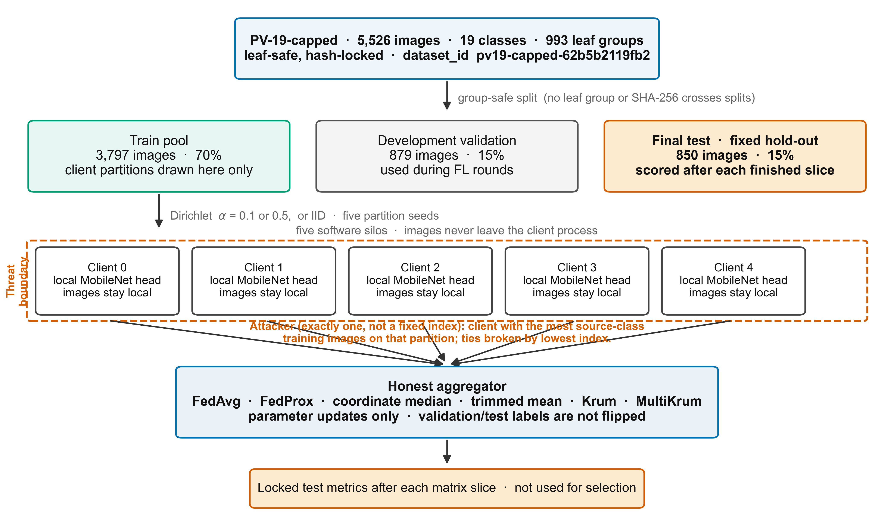
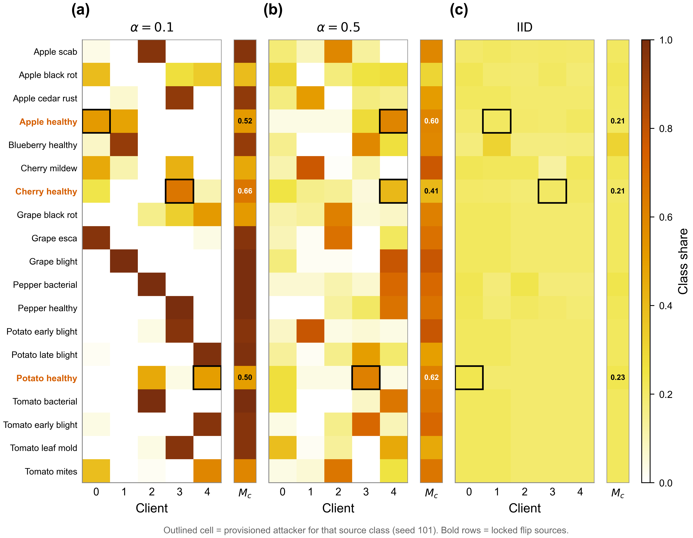
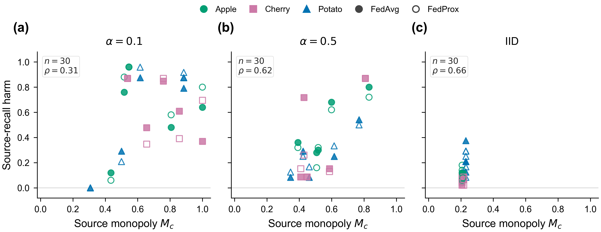
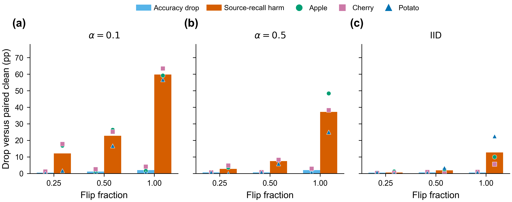
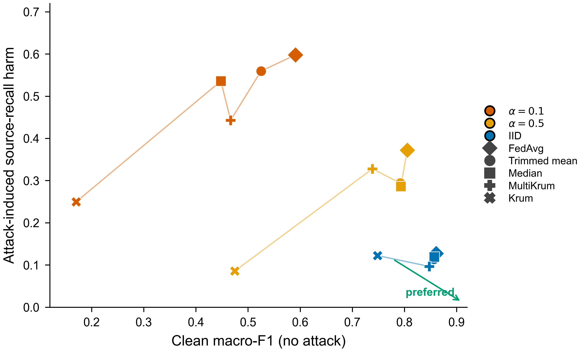

# A Locked Evaluation Protocol for Class Ownership Concentration in Small-Silo Federated Learning: Utility, Targeted Label Flipping, and Robust Aggregation

**Working title (not locked).**  
**Manuscript status:** draft based on locked PV-19-capped phases 3–4.2c and the locked PV-19-full follow-on slice (test evaluation completed). Figures 1–5 and Table 10 use those locked summaries. Table 9 uses the 8 September 2026 seed-block amendment. Tables 11–12 are the same-day secondary α / \(qM_c\) and LMM-specification analyses. Table 13 is the protocol chronology. Table 7 adds own-baseline source harm (9 September 2026). Visibility-gap arithmetic and source-to-target confusion are in §5.2 (10 September 2026; no new table). Sections 3 and 8 dump the executable training, partition, attack, and aggregation settings from the scored launchers (10 September 2026; no new table). The public GitHub artefact is tag `pv19-protocol-v2` (10 September 2026); it is not an OSF preregistration and not a DOI. Physical-edge measurements are out of scope for the claims below.

**Authors:** *to be completed*  
**Affiliation:** *to be completed*

---

## Abstract

This manuscript is a locked evaluation protocol, not a new federated optimiser and not a claim of field plant-disease diagnosis. Cross-silo federated learning (FL) is often motivated as a way for farms or clinics to train a shared image classifier without pooling raw photographs. Labels in that setting are rarely spread evenly: one participant may hold most examples of one class. Visual-FL papers commonly summarise that imbalance with a single Dirichlet concentration [5]. We measure class ownership concentration (the largest client share of a class) on the same partitions, and we ask how far that monopoly statistic tracks targeted-flip harm after accounting for α and for the poison dose it induces.

We report a prospectively locked small-silo experiment on a leaf-safe 19-class PlantVillage subset (5,526 images, 993 physical-leaf groups). Dataset, partitions, attack pairs, and slice definitions were fixed before training. Five clients train MobileNetV3-Small heads for ten rounds. This is not a public preregistration. The 31 August 2026 comparison list was written after locked-test files existed and before p-values were computed; blindness to means is not documented. Clean runs (60 jobs) cross three heterogeneity regimes, FedAvg versus FedProx, and one versus five local epochs. Targeted label flipping (90 jobs) remaps three locked source/target pairs at flip fraction 1.0; the attacker is the client with the most source-class training images on that partition. Robust aggregation under the same attack (180 jobs) compares coordinate median, trimmed mean, Krum, and MultiKrum. A further 180 jobs repeat FedAvg/FedProx at flip fractions 0.25 and 0.50. Model-update attacks (60 jobs) rescale the same Apple-monopoly client’s honest delta by s = −0.5 or s = −1. Clean runs of the four robust rules (60 jobs) separate aggregator tax from residual attack damage. A locked follow-on slice on the uncapped 19-class set (20,597 images; 45 jobs) repeats clean α = 0.1 / IID, apple flip 1.0, and median under that flip.

On the locked test set, stronger heterogeneity reduced macro-F1 from about 0.86 (IID, FedAvg, one local epoch) to about 0.59 (Dirichlet α = 0.1). FedProx helped most under strong non-IID data and did not outperform FedAvg under IID. Full-source label flipping cut source-class recall by tens of percentage points while overall accuracy often moved by only a few points. That mismatch is mostly the source class’s small share of a 19-class test set, not an evaluated detector. Geometric robust aggregators did not close that gap at α = 0.1; classic Krum incurred a large drop relative to clean FedAvg. Weaker fractions reduced source harm monotonically; at α = 0.1 a 0.50 flip still left about 23 points of pair-averaged source harm against about 1 point of accuracy drop, while IID 0.25/0.50 stayed near the clean source class. Reversed model updates did the opposite of label flipping under non-IID data: overall accuracy fell by about 17–35 points depending on scale, so the global score moved with the attack. Under IID the same one-client scale attack left accuracy within about 1–4 points of clean FedAvg. Clean Krum at α = 0.1 scored about 0.29 accuracy — essentially the same as Krum under flip 1.0 — so that overall-score collapse is an aggregator tax. Source-class recall under Krum still fell about 25 points versus clean Krum at the same α. Median and trimmed mean cost about 1 point or less versus clean FedAvg at α = 0.5 and IID, yet they still left large source-class harm under flip 1.0 at α = 0.1. On PV-19-full the visibility gap and the FedProx gain at α = 0.1 reappeared; apple-source recall under flip 1.0 at α = 0.1 was 0.264, the same mean as on the capped set. Mean source-class harm and the visibility gap were positive on all five partition seeds at every α; after averaging the three locked pairs within each seed, exact paired tests cannot reject at 0.05 (two-sided floor 0.0625). A mixed model on class-level test recall associated higher monopoly with an extra recall drop when that class was the flip target. Across flip fractions 0.25–1.0 that association is the induced global dose \(qM_c\), not a separable concentration effect at matched dose. We do not propose a new optimiser. The contribution is the protocol (group-safe split, paired partitions, class-level metrics, provisioned attacker, per-slice test evaluation) and the paired evidence that class-level concentration belongs in FL reports alongside α.

**Keywords:** federated learning; evaluation protocol; non-IID data; class monopoly; label flipping; robust aggregation; plant disease recognition

---

## 1. Introduction

Cross-silo federated learning lets several organisations update a shared model by exchanging parameters rather than examples [1], [2]. Crop photographs and farm records are a convenient case of data that operators may treat as assets: Kabala et al. train federated leaf-disease classifiers on PlantVillage images [3]; Idoje et al. train federated crop-type predictors from climate variables [4]. The same small-silo structure appears in other settings (a few hospitals, a few warehouses).

Two measurement habits shape how those systems are scored. First, label heterogeneity is often synthesised and summarised by a Dirichlet concentration α [5]. Second, many robust-aggregation and model-poisoning papers headline overall accuracy or test error after an attack [8], [9], [28]. Both habits can hide the failure mode studied here: **one class owned by one client**. If that client flips labels from a healthy class to a disease class, the global score may stay acceptable while the source class collapses. Tolpegin et al. already document that pattern on CIFAR-10 and Fashion-MNIST: label flipping can cut source-class recall while remaining classes stay comparatively intact [7]. We take that class-level observation into a five-silo regime where the attacker is the owner of the source class, and we test whether ownership concentration predicts the size of the harm.

This manuscript treats PlantVillage [10] as a controlled benchmark, not as a claim of field diagnostic accuracy. The scientific object is an evaluation protocol for the interaction of (i) class-level ownership, (ii) clean utility under a fixed communication budget, and (iii) targeted label flipping versus standard robust aggregators, all on identical partitions.

**Research questions (written in the 24 August 2026 protocol, before the scoring slices):**

- **RQ1.** How do Dirichlet heterogeneity and class ownership concentration affect global macro-F1, balanced accuracy, worst-class recall, and related metrics at a fixed round budget?
- **RQ2.** To what extent does source-class ownership concentration predict targeted label-flip harm and the gap between overall and source-class metrics?
- **RQ3.** How do FedAvg, FedProx, and selected robust aggregators change the clean-utility versus attack-robustness trade-off on those partitions?

Physical-device systems measurements and differential privacy are outside the claims of this paper. The study is a laboratory evaluation on Docker clients.

This paper does not propose a new FL algorithm [6], [8], [9], nor a new aggregator or poisoning attack, but it brings a locked evaluation protocol for how class-level ownership interacts with clean utility, targeted label flipping, and standard robust aggregation on identical partitions.

**Main contributions of this paper:**

1. A leaf-grouped, hash-locked 19-class capped subset with a train / development-validation / final-test split whose test split is never used for hyper-parameter search.
2. Class monopoly and normalised entropy reported alongside α, with five paired partition seeds.
3. Paired clean versus flip-1.0 evaluation of FedAvg and FedProx, then the same attack under median, trimmed mean, Krum, and MultiKrum, plus a locked flip-fraction dose-response (0.25 / 0.50 / 1.0).
4. Explicit reporting of source-class recall harm next to overall-metric movement, with the accuracy drop decomposed into the source’s test-share term and collateral change on other classes.
5. A paired model-update contrast (s = −0.5 / −1.0) showing that untargeted Byzantine scaling is visible in overall accuracy under the same non-IID partitions where targeted label flipping is not.
6. Clean runs of median, trimmed mean, Krum, and MultiKrum that separate aggregator tax from residual attack damage (RQ3).
7. A locked follow-on slice on PV-19-full that reproduces the clean heterogeneity/FedProx pattern and the apple-flip visibility gap on more images of the same 19 classes.
8. A 31 August 2026 comparison list (Tables 9–10) and later dated amendments, fit on archived locked-test predictions rather than on a new training matrix.

---

## 2. Related work

The review is organised by function, not by application slogan. Plant-disease and smart-farm FL papers [3], [4], [27] are cited only as the application setting: they show where class-concentrated silos can arise, not a leaderboard this work tries to beat, and not the claim that the contribution is a new crop-disease model.

### 2.1 Measuring statistical heterogeneity and federated optimisation

FedAvg averages client weights, usually weighted by local sample counts [1]. When local objectives differ, more local steps can increase client drift. Li et al. analyse FedAvg under non-identical data and show that heterogeneity slows the convergence rate for strongly convex smooth problems [26]. Hsu, Qi, and Brown synthesise client label vectors from a Dirichlet distribution with concentration α: as α → ∞ clients match a shared prior; as α → 0 each client tends toward a single class. On CIFAR-10 they report that FedAvg test accuracy falls as α decreases [5]. That construction is the heterogeneity axis in our matrix; we add a class-level monopoly statistic on the same partitions rather than treating α as a complete description of ownership.

FedProx adds a proximal term toward the current global weights. Li et al. give convergence guarantees under statistical and systems heterogeneity and report more stable, higher-accuracy behaviour than FedAvg on heterogeneous federated datasets [6]. SCAFFOLD uses control variates to correct client drift [25]. FedBN keeps batch-normalisation statistics local under feature-space non-IID data [11]. Kairouz et al. survey these and other open problems [2]. SCAFFOLD and FedBN are not in the locked matrix. We use FedAvg and FedProx so that later aggregator comparisons are not confounded by an untested optimiser.

### 2.2 Poisoning and robust aggregation

Biggio et al. study data poisoning against support-vector machines in the centralised setting [12]. In FL, Tolpegin et al. implement targeted poisoning as a data-only label flip: each malicious participant rewrites every local example of a source class to a target class, then trains with the honest optimiser. On CIFAR-10 and Fashion-MNIST they show that a small fraction of such participants can cut source-class recall while other classes remain comparatively intact, which they treat as a detection-evasion property [7]. LFighter is a later defence for that attack: it extracts output-layer gradients of putative source and target neurons, clusters those features, and filters suspected updates before FedAvg [13]. Our primary attack is the same data-only rewrite, but with a single provisioned attacker — the silo that holds the most source-class training images on that partition — rather than a random malicious fraction.

Attacks that manipulate the uploaded parameter vector are a different threat. Blanchard et al. design Krum for Byzantine gradient vectors [8]. Fang et al. formulate local model poisoning as an optimisation problem against Krum, coordinate median, trimmed mean, and Bulyan, with the goal of raising global test error [28]. Phase 4.2c (model-update) is a simpler one-client scale of the honest Apple-monopoly delta (s = −0.5 and s = −1); we do not claim Fang’s optimiser.

Coordinate-wise median and trimmed mean reduce the influence of coordinate outliers [9]. Krum (and MultiKrum) select updates that are close to a majority of others in Euclidean distance [8]. Under non-IID silos those geometric rules can discard honest but unusual clients, which shows up as a clean utility cost when that cost is measured. FoolsGold adapts client learning rates from historical cosine similarity of updates, targeting Sybil clones that share a poisoning objective [14]. We cite FoolsGold and LFighter as related defences, not as methods we re-implemented in phases 3–4.2a. Our 4.2a slice uses median, trimmed mean, Krum, and MultiKrum only.

### 2.3 Evaluation practice and agricultural FL

LEAF argues that federated experiments should report more than a single average accuracy: the authors include percentile performance across devices, systems cost, and how accuracy is weighted (per device versus per example), and they criticise purely artificial partitions of MNIST or CIFAR as an incomplete model of federated data [24]. Hsu et al. supply a continuous non-IID knob for visual classification [5]. Neither benchmark studies class monopoly as a predictor of targeted label-flip harm, and neither is a plant-disease testbed.

Application papers on crop images typically report overall accuracy after FedAvg or transfer-learning FL. Kabala et al. split four PlantVillage crop subsets (apple, corn, grape, tomato) equally and at random among 3, 5, or 7 clients, train with FedAvg, and vary the number of clients, communication rounds, and local epochs. Among the architectures they compare, ResNet50 reached mean accuracy and F1 near 99.5% on grape leaves in that protocol; they also note that ViT_B16 and ViT_B32 took more compute [3]. Idoje et al. apply FedAvg to a different agricultural task — predicting rice, maize, or chickpea from temperature, humidity, pH, and rainfall — and compare it with centralised Gaussian naïve Bayes on a PySyft testbed [4]. Aggarwal et al. report federated transfer learning and federated feature extraction for four rice-leaf diseases (5,932 images) with EfficientNetB3 as the selected base model at 99% validation accuracy, and they record GPU, CPU, and memory use alongside accuracy, precision, and recall, on both IID and non-IID splits [27]. We cite these papers as the application setting. None of them is a paired clean-versus-targeted-poisoning evaluation on locked partitions; none reports class ownership concentration as a predictor of attack harm; Kabala’s partitions are equal random draws, not Dirichlet. We do not treat their accuracy numbers as baselines to “beat” with a new network.

What this protocol adds, relative to that setting, is a group-safe test split evaluated after each matrix slice, five paired partition seeds, monopoly and entropy beside α, a provisioned source-class owner as attacker, and source-class recall reported next to overall accuracy on the same jobs.

---

## 3. Experimental system and threat model

### 3.1 Collaboration setting

We simulate five silos (software clients) and one aggregator. Each round, every client trains locally and returns a full parameter update. The server applies the named aggregation rule. Raw images never leave the client process. This is a laboratory FL deployment on Docker, not a multi-farm production network.

Figure 1 summarises the locked protocol. The 850-image test set is not used for hyper-parameter search. It is scored after each matrix slice finishes, then reused on later slices; it was not held unseen until the entire study ended. The attacker is not a fixed client index: it is the silo that holds the most source-class training images on that partition.

**Figure 1.** Locked small-silo protocol on PV-19-capped. Group-safe split, five software clients, honest aggregator, and a test set scored after each slice.

### 3.2 Locked slices

Scoring in this paper starts at phase 3. Phases 0–2 prepared the dataset and the evaluator; they are not scored here. Table 1 lists the locked scoring slices. In the laboratory log, stage 4.2c contains two slices run on the same date: model-update and clean robust. Family IDs F1–F3 in Table 9 are the 31 August 2026 comparison bundles, not phase numbers. Table 13 records what was already visible at each lock.

**Table 1.** Locked scoring slices on PV-19-capped and the locked PV-19-full follow-on slice.

| Slice | Jobs | Factors |
|-------|------|---------|
| Phase 3 (clean) | 60 | 3 distributions × {FedAvg, FedProx} × {E=1, E=5} × 5 seeds |
| Phase 4.1 (attack) | 90 | 3 pairs × 3 distributions × {FedAvg, FedProx} × E=1 × flip 1.0 × 5 seeds |
| Phase 4.2a (defence) | 180 | 3 pairs × 3 distributions × 4 aggregators × E=1 × flip 1.0 × 5 seeds |
| Phase 4.2b (fraction) | 180 | 3 pairs × 3 distributions × {FedAvg, FedProx} × E=1 × {0.25, 0.50} × 5 seeds |
| Phase 4.2c (model-update) | 60 | 3 distributions × {FedAvg, FedProx} × {s=−0.5, s=−1} × E=1 × 5 seeds |
| Phase 4.2c (clean robust) | 60 | 3 distributions × 4 aggregators × E=1 × 5 seeds |
| Phase 5 (PV-19-full) | 45 | clean α = 0.1 FedAvg/FedProx and IID FedAvg; apple flip 1.0 FedAvg; median under that flip; 3 α × 5 seeds |

### 3.3 Data and grouping

The source is the public PlantVillage colour leaf collection [10]. Physical-leaf identifiers come from the `leaf-map.json` that ships with that tree (40,328 keys). A map value counts as class-aware only when it starts with that class’s source-directory name (Apple black rot also accepts the documented “Frogeye Spot” prefix). Unmapped images are not given a guessed ID. The 99% rule is class-level: a class is dropped if mapped images divided by that class’s image count is below 0.99. Eight classes failed that gate (`Grape___healthy`, `Squash___Powdery_mildew`, and six tomato classes listed in the dataset summary). After the class filter, remaining images without a class-aware ID are dropped (`require_leaf_id`). The locked capped set has 5,526 images, 19 classes, 993 groups, a cap of 300 images per class, and zero unknown leaf IDs (`dataset_id` `pv19-capped-62b5b2119fb2`). Exact-duplicate SHA-256 collisions were union-find merged with leaf groups. A perceptual-hash audit listed candidates; automatic merging on a loose threshold was not used, because it both missed known siblings and proposed cross-split pairs.

A single group-safe split (70% / 15% / 15% by class at group level; split seed 20260824) yields 3,797 train, 879 development-validation, and 850 final-test images. No leaf group and no SHA-256 appears in more than one split. Client partitions are drawn only from the train pool. Development validation is used during rounds. **Final test is evaluated once per completed matrix slice**, after training of that slice finishes. The same 850 images are reused on later slices; they were not held until every phase had finished.

**Groups stay intact among clients, not only among splits.** Each physical-leaf group is assigned to exactly one client, so photographs of the same training leaf do not appear at two silos. That is a separate guarantee from train/test leakage.

**Dirichlet allocation (scored runs).** This is Hsu-style class shares across clients [5], not a draw of label mixtures inside a client. For each class independently: draw a 5-vector from \(\mathrm{Dirichlet}(\alpha,\ldots,\alpha)\); convert it to image-count targets; shuffle that class’s leaf groups; assign each group to the client with the largest remaining deficit (ties: fewer images already assigned, then lower client index). If any client has fewer than 20 training images, redraw (up to 100 attempts). The IID control assigns each group to the client currently holding the fewest images of that class (tie: lowest index). Partition seeds are 101, 211, 307, 401, 503. The launcher is `infra/generate_pv19_partitions.sh`.

An exploratory 27-class capped subset was abandoned before any new scientific FL run because leaf metadata and perceptual leakage failed the dataset gate. That decision is a protocol deviation logged before model scores were inspected.

### 3.4 Model and optimisation budget

Scored jobs train MobileNetV3-Small [16] with torchvision `MobileNet_V3_Small_Weights.DEFAULT` (ImageNet) cached in the client image. `model.features` is frozen (`FL_FREEZE_BACKBONE=1` on every matrix job). The torchvision classifier block (Linear–Hardswish–Dropout–Linear) stays trainable; the last Linear is replaced with 19 outputs. That is the scored setting, not a full-network fine-tune and not “frozen by default” as an optional switch.

Local optimiser: AdamW, learning rate \(10^{-3}\), weight decay \(10^{-4}\), default \(\beta=(0.9, 0.999)\); no schedule. Loss: mean cross-entropy. A new AdamW state is created each round and discarded; it is not sent to the server and not carried across rounds. Inputs are 128×128. Training batch size is 16 (`FL_BATCH_SIZE=16` in `run_fl_sequential.sh`; 32 is only the offline evaluator). Ten communication rounds; all five clients fit every round. All five clients in a job receive the same `FL_SEED` (the partition seed). FedProx adds \(0.5\mu\|w-w_{\mathrm{global}}\|^2\) on trainable parameters with μ = 0.01. Local epochs E ∈ {1, 5} are compared at the same round count; equalising total local steps across E is a secondary analysis and is not required for the tables below. Heterogeneity: Dirichlet α = 0.1, α = 0.5, and an IID control.

Train transforms: RandomResizedCrop(128, scale 0.75–1.0), RandomHorizontalFlip(0.5), ColorJitter(brightness 0.15, contrast 0.15, saturation 0.1, hue 0.02), then ImageNet mean and standard deviation. Development validation and locked test: Resize(160), CenterCrop(128), same normalisation.

Batch-normalisation buffers in the frozen backbone are **not** frozen. Local steps run `model.train()`, so those running statistics still update. They travel in `state_dict` and are aggregated with the other tensors. They are not skipped and are not DP-clipped in these jobs (DP slices are out of scope).

### 3.5 Heterogeneity measures

For each class \(c\), if \(s_{k,c}\) is client \(k\)'s share of that class's training images (\(\sum_k s_{k,c}=1\)) and \(H_c = -\sum_{k:s_{k,c}>0} s_{k,c}\ln s_{k,c}\) is the Shannon entropy of that share vector (\(K=5\) clients),

- **monopoly** \(M_c = \max_k s_{k,c}\),
- **normalised entropy** \(\tilde{H}_c = H_c / \ln K\),
- **effective clients** \(N_c^{\mathrm{eff}} = e^{H_c}\).

Attack pairs were locked from these partition statistics without looking at final-test predictions.

Figure 2 shows one locked realisation (seed 101). At \(\alpha=0.1\) most classes concentrate on a single client; under IID the same classes are split almost evenly. Outlined cells mark the provisioned attacker for each locked source class.

**Figure 2.** Class-by-client training shares, partition seed 101. Cell values are class shares (rows sum to one); the side column is \(M_c\). Bold rows: locked flip sources; outlined cells: attacker. (a) \(\alpha=0.1\); (b) \(\alpha=0.5\); (c) IID.

### 3.6 Threat model (label flip)

A single provisioned client is malicious. It is not always client 0. On each partition it is the client with the most training images of the source class. In the primary attack slice it remaps every source example in its local train set to the target class (flip fraction 1.0). Phase 4.2b repeats the same pairs, attackers, and FedAvg/FedProx jobs at fractions 0.25 and 0.50: the client remaps \(\max(1,\lfloor q N_{k,c}\rfloor)\) of its local source examples, sampled with attack-config seed 1337. That mask is drawn once when the client process starts and is not redrawn each round or epoch. The 0.25 / 0.50 / 1.0 JSON files share that seed, so on a given partition the smaller mask is a subset of the larger (q = 1 takes every local source index). Job histories record `label_flipped_samples`. Honest clients train on true labels. The aggregator is honest. The attacker cannot modify other clients or the server. Validation and test labels are not flipped.

Because the attacker is the largest owner of class \(c\), it holds \(M_c N_c\) source training images. The globally corrupted share of that class is then the flipped count divided by \(N_c\). On this archive that quantity equals \(M_c\) at \(q=1\) and stays within 0.004 of \(q M_c\) at \(q<1\) (the integer floor). Monopoly is therefore the exposure measure under this threat model; it is not an independently manipulated concentration factor.

Locked pairs (same crop; PV-19 names) were chosen from train-partition statistics to span class concentration and to include a small-support source:

1. `Apple___healthy` → `Apple___Apple_scab`
2. `Cherry___healthy` → `Cherry___Powdery_mildew`
3. `Potato___healthy` → `Potato___Late_blight` (104 source train images)

Mean source monopoly across five seeds (lock document): Cherry 0.762 / 0.536 / 0.211 at α = 0.1 / 0.5 / IID; Apple 0.661 / 0.569 / 0.209; Potato 0.638 / 0.523 / 0.231. At α = 0.1 the ranking is Cherry, then Apple, then Potato. At α = 0.5 Apple is slightly highest of the three. Potato is the thin-support contrast, not a large monopoly gap.

### 3.7 Robust aggregation (phase 4.2a)

On the same flip-1.0 jobs we compare four aggregators implemented by Flower 1.32.1, not a local reimplementation: coordinate median (`FedMedian`); trimmed mean (`FedTrimmedAvg`, β = 0.25); Krum with f = 1 and `num_clients_to_keep=0` (keep one update); and MultiKrum with f = 1 and keep = n − f = 4. Every `state_dict` tensor is sent, including non-trainable batch-norm buffers. FedAvg and FedProx use Flower’s sample-weighted mean (local train count). With five clients, β = 0.25 trims \(\lfloor 0.25\times 5\rfloor=1\) client from each tail and averages the other three. Five clients and f = 1 satisfy the original Krum count \(n>2f+2\) (5 > 4). That inequality is not the scientific issue here: Blanchard et al. assume a common unbiased gradient estimator, which strongly heterogeneous local training violates [8]. keep = 4 is the MultiKrum choice in those experiments, not an implementation error. Local epochs remain E = 1. Table 4’s source harm and accuracy gap versus clean FedAvg mix residual poison with aggregator tax. Table 7 reports the clean tax and attack-induced source harm versus each aggregator’s own clean run.

### 3.8 Model-update attack (phase 4.2c)

The same provisioned attacker as the Apple label-flip pair (highest `Apple___healthy` train count, tie lowest index) multiplies its honest parameter delta by s ∈ {−0.5, −1.0} in every round: the client sends \(w_{\mathrm{global}}+s(w_{\mathrm{local}}-w_{\mathrm{global}})\) on floating tensors and copies non-float entries unchanged. Labels are not flipped. Honest clients send unmodified updates. FedAvg and FedProx are the aggregators in this slice; robust rules were not re-selected from these test numbers.

### 3.9 Clean robust aggregators (phase 4.2c)

The second 4.2c slice trains median, trimmed mean (β = 0.25), Krum (f = 1), and MultiKrum (keep 4) with no attack on the same E = 1 partitions. Those jobs supply each aggregator’s clean source-class recall, so Table 7 can split Table 4’s FedAvg-relative source deficit into clean source-class cost plus attack-induced harm.

### 3.10 Follow-on PV-19-full (phase 5)

The uncapped leaf-safe 19-class set (`pv19-full-774007483a1d`) has 20,597 images and a locked test of 3,110 images. Partitions reuse the capped seeds and α values. The apple attacker is recomputed on each full train partition (max `Apple___healthy`, tie lowest index), not copied from the capped attacker table. The locked 45-job slice is clean α = 0.1 FedAvg/FedProx and IID FedAvg; apple flip 1.0 × FedAvg on α = 0.1 / 0.5 / IID; and median under the same flip. There is no paired full clean FedAvg at α = 0.5.

---

## 4. Experimental design and metrics

### 4.1 Matrices

The locked slice counts are in Section 3.2. Paired comparisons use the same seed and partition across algorithms and clean/attack.

### 4.2 Primary metrics (locked test, round 10)

The locked-test confusion matrix supplies accuracy, balanced accuracy, macro-F1, per-class recall, worst-class recall, and 10th-percentile class recall. Under attack we also report source-class recall, source-class harm (clean minus attacked source recall, paired), and drops in accuracy and macro-F1 versus the paired clean E=1 run. For 4.2a we report source-recall recovery versus attacked FedAvg, and accuracy/macro-F1 relative to attacked FedAvg and to clean FedAvg.

For 4.2b the same harm and drop metrics are reported at fractions 0.25 and 0.50, paired with both the clean E=1 run and the flip-1.0 job. For 4.2c model-update the headline quantities are overall accuracy, macro-F1, and their paired drops versus clean E=1 (untargeted Byzantine scaling, not source-class harm). For the clean robust runs we report accuracy, macro-F1, and the gap to clean FedAvg E=1, plus pair-averaged clean source recall and attack-induced source harm versus that aggregator’s own clean baseline (Table 7). Harm versus clean FedAvg remains the deployment deficit in Table 4.

Reported scores are the locked test at round 10, not the best development-validation checkpoint seen during training. Validation scores exist in the job histories. We do not headline them: no validation-curve summary was locked on 24 August, and adding one now would be exploratory. Their omission is not a claim that preregistration forbids extra plots.

### 4.3 Statistics

Tables 2–8 report the mean and standard deviation over five seeds. Those numbers describe the locked test. They do not say whether a paired difference is compatible with zero, or whether monopoly predicts targeted harm once the same seed and class appear in many jobs. Section 5.8 answers those questions on the archived test files only; no training job was added. The F1–F3 list and the Gaussian LMM formula were written on 31 August 2026, after those test files existed and before p-values were computed. That is a locked analysis of archived predictions, not a public preregistration and not a documented blind analysis of means (Table 13).

A family is one 31 August bundle of tests that ask the same scientific question (for example: is source-class harm different from zero at each of the three α values?). We adjust p-values inside each family with Holm’s procedure [18], which makes rejection harder when several tests share that question, and we do not pool families. Wilcoxon signed-rank tests [22] on the same protocol units are a sensitivity check only; they do not override Holm.

The primary test is an exact paired permutation test of the mean difference [17]. The inferential target is a new partition-and-training replicate. The five integers 101, 211, 307, 401, 503 each draw a client partition from the locked train pool and are also passed to the client as `FL_SEED` (Python, NumPy, and PyTorch RNGs at process start). The label-flip mask uses a separate attack-config seed; which source examples are eligible still depends on that partition. A protocol “seed” in that laboratory sense is therefore a joint replicate of ownership pattern and training randomness.

For clean comparisons (F1, F1b, F3.5) the unit is one paired gap per seed. For attack families (F2a, F2b, F2c, F3.1–F3.4) the three locked source pairs share a partition and, for F2b rows, the same clean overall accuracy. We therefore average the three pair-level gaps inside each seed and sign-flip those five seed-level means — equivalently, flip all three pair signs together. Treating the 15 pair×seed gaps as independently flippable would understate that dependence; those n = 15 p-values are archived only as a diagnostic.

F2b tests whether source-recall harm minus accuracy drop is zero. Those two quantities are on different scales: harm is one class, accuracy weights that class by its test share \(\pi_s\). On this 19-class test set \(\pi_s\) is 50/850 (Apple), 46/850 (Cherry), and 24/850 (Potato). A 60-point source-recall drop then contributes about 3.5 / 3.2 / 1.7 points to accuracy if other classes do not move. We keep F2b as an operational visibility summary, not as a scientific null that class-level harm should equal a prevalence-weighted drop. Section 5.2 reports \(\pi_s H_s\), the collateral remainder, and source-to-target confusion.

Under the claim “there is no gap”, each seed-level mean is equally likely to have come out positive or negative. The p-value is the fraction of all 32 sign assignments whose mean is at least as far from zero as the mean we actually saw. With five seeds the smallest two-sided p-value is \(2/32 = 0.0625\), so no family in Table 9 can reject at 0.05 under that rule. We still report those tests.

A 95% confidence interval (CI) is a percentile bootstrap interval [19] for the mean of the same five seed-level gaps (10,000 resamples; the random seed is recorded in the analysis script). When all five observed gaps have the same sign, every ordinary bootstrap mean lies on that side of zero, so an interval that excludes zero does not resolve the exact test’s limited resolution. We report both numbers; the interval describes these five replicates and is not a substitute for the permutation test.

RQ2 also uses a linear mixed model [21] of locked-test class recall (2,280 class×job rows: clean E = 1 FedAvg/FedProx and flip-1.0 jobs; 19 classes). “Mixed” means the model has ordinary coefficients plus a random intercept for seed and one for class, so repeated jobs from the same seed or class are not treated as independent. “Gaussian” means recall is treated as a continuous score. The protocol formula is recall on monopoly, normalised entropy, algorithm, a targeting indicator, monopoly×targeting, and algorithm×targeting. **Targeting is 1 only when that class is the locked flip source in that job.** A job-level attack flag *alone* would mix targeted harm with collateral change on the other 18 classes; Table 12 therefore adds that flag *alongside* targeting as a sensitivity, not as a replacement. Monopoly and entropy come from the train partition. A binomial GEE [23] on the same counts, clustered by seed, is a sensitivity check (five clusters) and does not validate the LMM. Test-set support is fixed per class, so it cannot be used as a within-class covariate. The targeting interaction is identified on the three locked source classes, not on 19 independently attacked classes.

Spearman’s ρ [20] is a rank correlation: 1 if two quantities rise together in rank, 0 if there is no monotone link. We report it for train monopoly versus source harm on the 45 FedAvg flip-1.0 jobs as a companion to Figure 3. The mixed-model interaction, not ρ, is the 31 August RQ2 formula; Table 12 stress-tests that specification. Table 11 is a secondary comparison, added after that plan: it places α next to monopoly and evaluates harm against the induced dose \(qM_c\) on the 4.2b jobs as well. Those regressions are not Holm families.

---

## 5. Results

Percentages in the text are 100 × the locked means. Unless noted, n = 5 seeds.

### 5.1 Clean utility (RQ1)

Table 2 summarises the 12 clean configurations.

**Heterogeneity dominates optimiser choice.** With E = 1 and FedAvg, test accuracy (macro-F1) was 86.1% (86.1%) under IID, 80.9% (80.5%) at α = 0.5, and 63.6% (59.1%) at α = 0.1. Worst-class recall fell from 63.9% (IID) to 1.4% (α = 0.1): the global model can look “usable” in accuracy while at least one class is almost never recovered.

**FedProx helped when concentration was strong.** At α = 0.1, FedProx improved E = 1 accuracy from 63.6% to 67.8% and macro-F1 from 59.1% to 64.9%; with E = 5 the gains were 70.2% → 75.3% accuracy and 66.5% → 73.7% macro-F1. Under IID, FedProx was slightly below FedAvg (E = 1: 85.7% vs 86.1% accuracy). That pattern matches the usual story that a proximal term is most useful when local and global models diverge [6], not as a universal accuracy boost. The five paired α = 0.1 macro-F1 gaps all favour FedProx (mean +0.058; bootstrap 95% CI 0.039 to 0.076); exact permutation p = 0.0625 and Holm p = 0.19, so the primary n = 5 rule does not reject (Table 9). The IID interval includes zero.

**More local epochs at a fixed ten rounds improved clean utility** in every row of Table 2, at roughly 4–5× wall-clock cost in this implementation. That comparison is not an equal local-work budget.

**Table 2.** Locked test metrics, clean runs (mean ± sd, five seeds).

| α | Algorithm | E | Accuracy | Macro-F1 | Balanced acc. | Worst-class recall |
|---|-----------|---|----------|----------|---------------|-------------------|
| 0.1 | FedAvg | 1 | 0.636 ± 0.061 | 0.591 ± 0.076 | 0.643 ± 0.057 | 0.014 ± 0.031 |
| 0.1 | FedAvg | 5 | 0.702 ± 0.050 | 0.665 ± 0.068 | 0.709 ± 0.048 | 0.059 ± 0.109 |
| 0.1 | FedProx | 1 | 0.678 ± 0.045 | 0.649 ± 0.055 | 0.685 ± 0.043 | 0.092 ± 0.080 |
| 0.1 | FedProx | 5 | 0.753 ± 0.042 | 0.737 ± 0.049 | 0.759 ± 0.040 | 0.233 ± 0.164 |
| 0.5 | FedAvg | 1 | 0.809 ± 0.032 | 0.805 ± 0.036 | 0.811 ± 0.030 | 0.463 ± 0.146 |
| 0.5 | FedAvg | 5 | 0.842 ± 0.028 | 0.839 ± 0.030 | 0.845 ± 0.026 | 0.523 ± 0.125 |
| 0.5 | FedProx | 1 | 0.821 ± 0.021 | 0.820 ± 0.023 | 0.823 ± 0.020 | 0.542 ± 0.101 |
| 0.5 | FedProx | 5 | 0.852 ± 0.009 | 0.851 ± 0.010 | 0.853 ± 0.009 | 0.627 ± 0.053 |
| IID | FedAvg | 1 | 0.861 ± 0.005 | 0.861 ± 0.006 | 0.862 ± 0.005 | 0.639 ± 0.047 |
| IID | FedAvg | 5 | 0.879 ± 0.005 | 0.878 ± 0.005 | 0.880 ± 0.005 | 0.664 ± 0.048 |
| IID | FedProx | 1 | 0.857 ± 0.005 | 0.856 ± 0.005 | 0.858 ± 0.005 | 0.612 ± 0.062 |
| IID | FedProx | 5 | 0.874 ± 0.002 | 0.874 ± 0.003 | 0.875 ± 0.002 | 0.668 ± 0.041 |

Seed-to-seed spread was largest at α = 0.1, which is expected when Dirichlet draws assign different monopolies per seed.

### 5.2 Targeted label flipping (RQ2)

Phase 4.1 used the same E = 1 clean checkpoints’ partitions. Table 3 lists overall drops and source-class harm.

**Visibility gap.** At α = 0.1, FedAvg accuracy dropped by about 0.4–4.2 percentage points depending on the pair, while source-class recall harm was about 57–64 points. That mismatch is mostly arithmetic. Accuracy is the support-weighted mean of class recall, so \(\Delta\mathrm{Accuracy}=\sum_c\pi_c D_c=\pi_s H_s+\sum_{c\ne s}\pi_c D_c\). Locked test supports are fixed: Apple 50, Cherry 46, Potato 24 of 850 images (\(\pi_s=0.059/0.054/0.028\); \(1/19\approx0.053\)). The source term \(\pi_s H_s\) at α = 0.1 is 0.035 / 0.034 / 0.016; observed accuracy drops are 0.016 / 0.042 / 0.004. Collateral on the other 18 classes is therefore −0.019 / +0.008 / −0.012: Cherry’s 4.2-point drop sits near the source-term ceiling plus a little extra damage, while Apple and Potato are partly offset by small gains elsewhere. Pair-averaged, the source term is 0.028 and the accuracy drop is 0.021. Balanced accuracy, which weights classes equally, moves by \(H_s/19\) plus the mean of the other \(D_c\); at α = 0.1 that source share is about 3.1 points. We did not evaluate an alert threshold or a temporal detector. What the tables support is that overall accuracy substantially understates source-class damage.

**Source-to-target confusion.** Source recall alone does not say where the lost examples went. At α = 0.1, \(P(\hat y=\mathrm{target}\mid y=\mathrm{source})\) was 0.584 / 0.691 / 0.425 for Apple / Cherry / Potato (pair mean 0.567), versus near zero on the paired clean jobs. Among source-class errors, 0.77 / 0.76 / 0.42 went to the locked target: Apple and Cherry are mostly redirected; Potato is more dispersed. Target-class precision fell (Apple −0.13, Cherry −0.25, Potato −0.21). Target recall rose for Apple (+0.24) and Potato (+0.13) and barely moved for Cherry (+0.03). The attack is targeted in the Apple and Cherry rows; Potato’s recall collapse is not the same as dumping the class onto Late blight.

Cherry (highest locked monopoly at α = 0.1) combined a 4.2 point accuracy drop with 63.5 point source harm and source recall 0.087 ± 0.194. Potato, with 24 test images, still showed ~57 point harm with a 0.4 point accuracy drop because \(\pi_s H_s\) itself is only 1.6 points.

**α / monopoly gradient.** Mean FedAvg source harm fell from the 0.57–0.64 range at α = 0.1 to 0.25–0.48 at α = 0.5 and to 0.06–0.10 for Apple and Cherry under IID. Potato under IID remained higher (0.225), consistent with thin source support rather than monopoly alone. Pair-averaged harm and the visibility gap were positive on all five partition seeds at every α; after averaging the three pairs within seed, exact tests cannot reject a zero mean at 0.05 (Table 9).

Figure 3 shows the same 90 flip-1.0 jobs within each α. The pooled FedAvg Spearman ρ between train monopoly and source harm is 0.78 (seed-resampled 95% CI 0.71 to 0.84). Within α the rank correlations are 0.30 / 0.62 / 0.63 (n = 30 jobs at α = 0.1 / 0.5 / IID). The α = 0.1 cloud is only weakly monotone. Under IID, \(M_c\) barely moves (0.207–0.231), so that panel mostly ranks potato against the other two pairs. Table 11 reports the α-controlled and dose comparisons. The mixed model in Section 5.8 is the protocol association of monopoly with extra recall loss when the class is the flip target (Table 12 stress-tests that specification).

**Figure 3.** Source-class monopoly versus paired source-recall harm after flip 1.0, shown within each heterogeneity regime (n = 30 jobs per panel). Colour/shape: pair; filled: FedAvg; open: FedProx. Spearman ρ on each panel is within that α only; the pooled FedAvg ρ = 0.78 is in Table 11.

**FedProx is not a poisoning defence.** Source harm under FedProx was similar to FedAvg and sometimes larger (Apple at α = 0.1: 0.656 vs 0.592). Paired FedProx minus FedAvg harm at α = 0.1 was +0.030 (bootstrap 95% CI −0.023 to 0.081; Holm p = 0.75). The proximal term addresses client drift in clean non-IID training [6]; it does not inspect labels. Failure to reject here is not an equivalence proof; the interval is simply compatible with a small difference.

**Table 3.** Flip fraction 1.0, E = 1, locked test (mean ± sd). Harm = paired drop in source-class recall versus clean FedAvg/FedProx E=1. Test supports are 50 / 46 / 24 of 850 for Apple / Cherry / Potato. Accuracy-drop arithmetic and source-to-target rates are in the text above.

| α | Alg. | Pair | Accuracy | Acc. drop vs clean | Macro-F1 drop | Source recall | Source harm |
|---|------|------|----------|--------------------|---------------|---------------|-------------|
| 0.1 | FedAvg | Apple | 0.621 | 0.016 | 0.014 | 0.264 ± 0.394 | 0.592 ± 0.317 |
| 0.1 | FedAvg | Cherry | 0.595 | 0.042 | 0.050 | 0.087 ± 0.194 | 0.635 ± 0.221 |
| 0.1 | FedAvg | Potato | 0.632 | 0.004 | 0.014 | 0.333 ± 0.465 | 0.567 ± 0.399 |
| 0.1 | FedProx | Apple | 0.656 | 0.022 | 0.026 | 0.268 ± 0.414 | 0.656 ± 0.362 |
| 0.1 | FedProx | Cherry | 0.643 | 0.036 | 0.043 | 0.183 ± 0.272 | 0.635 ± 0.253 |
| 0.1 | FedProx | Potato | 0.669 | 0.009 | 0.021 | 0.350 ± 0.483 | 0.592 ± 0.452 |
| 0.5 | FedAvg | Apple | 0.783 | 0.026 | 0.022 | 0.480 ± 0.245 | 0.484 ± 0.239 |
| 0.5 | FedAvg | Cherry | 0.781 | 0.029 | 0.034 | 0.504 ± 0.424 | 0.383 ± 0.380 |
| 0.5 | FedAvg | Potato | 0.804 | 0.005 | 0.007 | 0.608 ± 0.168 | 0.250 ± 0.189 |
| 0.5 | FedProx | Apple | 0.798 | 0.023 | 0.019 | 0.528 ± 0.253 | 0.428 ± 0.233 |
| 0.5 | FedProx | Cherry | 0.798 | 0.023 | 0.026 | 0.596 ± 0.344 | 0.300 ± 0.325 |
| 0.5 | FedProx | Potato | 0.815 | 0.007 | 0.010 | 0.608 ± 0.173 | 0.275 ± 0.149 |
| IID | FedAvg | Apple | 0.861 | 0.000 | 0.000 | 0.868 ± 0.023 | 0.100 ± 0.035 |
| IID | FedAvg | Cherry | 0.851 | 0.010 | 0.010 | 0.843 ± 0.028 | 0.057 ± 0.025 |
| IID | FedAvg | Potato | 0.856 | 0.005 | 0.008 | 0.683 ± 0.096 | 0.225 ± 0.091 |
| IID | FedProx | Apple | 0.860 | −0.003 | −0.004 | 0.868 ± 0.054 | 0.104 ± 0.054 |
| IID | FedProx | Cherry | 0.857 | 0.000 | 0.000 | 0.848 ± 0.022 | 0.057 ± 0.025 |
| IID | FedProx | Potato | 0.854 | 0.003 | 0.005 | 0.708 ± 0.083 | 0.217 ± 0.090 |

Standard deviations of source recall at α = 0.1 are large: some seeds lose the class almost completely, others retain it. Any “monopoly predicts harm” claim must be seed-aware; five seeds are a minimum, not a large sample.

### 5.3 Robust aggregators under flip 1.0 (RQ3)

Table 4 averages the three pairs (still n = 5 seeds per pair, then unweighted mean of those three means).

**Classic Krum paid the largest gap to clean FedAvg** (accuracy about 0.30 at α = 0.1 and 0.53 at α = 0.5) and did not restore source recall on average. With five clients and f = 1, Krum keeps a single update; under class-concentrated non-IID that update is a poor global model. This matches prior warnings that distance-based rules can be expensive when honest updates already disagree [8], [13]. The 0.511 source-harm column versus clean FedAvg at α = 0.1 is not all poison: Table 7 splits it into 0.262 clean source-class cost and 0.250 attack-induced harm versus clean Krum.

**Median and trimmed mean stayed close to attacked FedAvg overall accuracy** at α = 0.5 and IID (gaps of about 0–2 points in the pair-averaged table) and showed modest mean source-recall recovery versus attacked FedAvg at α = 0.5 (~10 points). They did not remove source harm at α = 0.1 (pair-averaged harm still ~0.59–0.63). MultiKrum (keep 4) sat between Krum and the coordinate-wise rules on overall accuracy, with little mean source recovery versus FedAvg.

**No aggregator in this slice dominated both overall utility under attack and source-class recovery** at α = 0.1. Paired source-recall recovery versus attacked FedAvg at α = 0.1 was indistinguishable from zero for median, trimmed mean, MultiKrum, and Krum after Holm (Table 9). Clean Krum still sat 0.420 macro-F1 below clean FedAvg at α = 0.1 (bootstrap 95% CI −0.486 to −0.355) even though n = 5 permutation cannot reject after Holm. That is the empirical content of RQ3 for flip 1.0, not a ranking for weaker fractions (those jobs used FedAvg/FedProx only; aggregators were not re-selected from 4.2b test numbers).

**Table 4.** Robust aggregators, flip 1.0, E = 1. Values are means of the three pair-wise means. Recovery versus attacked FedAvg; harm and utility gap versus clean FedAvg E=1 (deployment baseline). That source-harm column mixes residual attack damage with clean source-class cost; Table 7 splits those terms.

| α | Aggregator | Accuracy | Macro-F1 | Source recall | Acc. recovery vs FedAvg attack | Source recovery | Source harm vs clean | Gap vs clean FedAvg acc. |
|---|------------|----------|----------|---------------|--------------------------------|-----------------|---------------------|--------------------------|
| 0.1 | Krum | 0.304 | 0.184 | 0.314 | −0.312 | 0.086 | 0.511 | 0.333 |
| 0.1 | Median | 0.502 | 0.429 | 0.199 | −0.114 | −0.029 | 0.627 | 0.134 |
| 0.1 | MultiKrum | 0.539 | 0.451 | 0.227 | −0.077 | −0.002 | 0.599 | 0.098 |
| 0.1 | Trimmed mean | 0.576 | 0.505 | 0.233 | −0.040 | 0.005 | 0.593 | 0.061 |
| 0.5 | Krum | 0.533 | 0.480 | 0.517 | −0.256 | −0.014 | 0.386 | 0.276 |
| 0.5 | Median | 0.787 | 0.778 | 0.634 | −0.002 | 0.103 | 0.269 | 0.022 |
| 0.5 | MultiKrum | 0.750 | 0.735 | 0.531 | −0.039 | 0.000 | 0.373 | 0.059 |
| 0.5 | Trimmed mean | 0.792 | 0.787 | 0.631 | 0.003 | 0.100 | 0.273 | 0.017 |
| IID | Krum | 0.747 | 0.742 | 0.727 | −0.109 | −0.071 | 0.199 | 0.114 |
| IID | Median | 0.855 | 0.853 | 0.813 | −0.001 | 0.015 | 0.112 | 0.006 |
| IID | MultiKrum | 0.846 | 0.845 | 0.807 | −0.010 | 0.009 | 0.118 | 0.015 |
| IID | Trimmed mean | 0.856 | 0.855 | 0.813 | 0.000 | 0.015 | 0.112 | 0.005 |

### 5.4 Flip-fraction sensitivity (RQ2, dose)

Phase 4.2b reused the 4.1 partitions, pairs, attackers, FedAvg/FedProx, and E = 1, changing only the flip fraction \(q\) to 0.25 or 0.50 (180 jobs; floor rule in Section 3.6). Table 5 is pair-averaged like Table 4; flip 1.0 is copied from the 4.1 pair averages so the three fractions sit on one scale. We did not use Table 5 to choose the 4.2c treatments; those slices were locked beforehand.

**Harm rose with fraction, and overall accuracy still understated source-class damage at α = 0.1.** At α = 0.1, pair-averaged FedAvg source harm was 0.121 (flip 0.25), 0.228 (0.50), and 0.598 (1.0). Accuracy drops on the same rows were 0.4, 1.1, and 2.1 points.

Figure 4 places both quantities on the same percentage-point scale. At α = 0.1 and 0.5 the accuracy drop stays small while source-class harm is larger, and that gap shrinks as \(\alpha\) increases. The pattern is not universal: IID FedAvg at fraction 0.25 has source harm and accuracy drop both 0.005 (Table 5).

**Figure 4.** Accuracy drop versus source-recall harm by flip fraction, FedAvg (\(E=1\)). Bars: unweighted means of three pairs; markers: Apple, Cherry, Potato (\(n=5\) seeds each). (a) \(\alpha=0.1\); (b) \(\alpha=0.5\); (c) IID. At IID fraction 0.25 both bars are 0.5 points.

**IID 0.25/0.50 stayed near the clean source class.** FedAvg pair-averaged source harm was 0.005 and 0.019; overall accuracy was indistinguishable from the flip-1.0 IID rows (~0.856). Full flipping is what produces the ~13-point IID source harm in Table 3.

**The pair gradient compressed but did not vanish at α = 0.1.** FedAvg cherry harm was 0.178 / 0.252 at fractions 0.25 / 0.50 versus potato 0.017 / 0.167 (apple 0.168 / 0.264). Cherry remains the highest locked monopoly at α = 0.1; potato’s smaller support still shows up more clearly once half the attacker’s source labels are flipped.

Across the 270 FedAvg/FedProx jobs at \(q\in\{0.25,0.50,1.0\}\), source harm tracks the induced global dose \(qM_c\) (Spearman \(\rho=0.77\)). Adding monopoly beside \(qM_c\) does not improve a leave-one-seed-out prediction of harm (Table 11). That is the mechanical reading of the pair gradient in this section: Cherry’s higher \(M_c\) at \(\alpha=0.1\) is a larger flipped share, not a separately identified concentration effect.

FedProx tracked FedAvg at every fraction. Weaker fractions are not a licence to re-rank median, trimmed mean, or Krum; those aggregators were measured only under flip 1.0.

**Table 5.** Flip-fraction sensitivity, E = 1, locked test. Values are unweighted means of the three pair-wise means (n = 5 seeds per pair). Flip 1.0 is the 4.1 pair average. Harm = drop in source-class recall versus clean FedAvg/FedProx E=1.

| α | Alg. | Fraction | Accuracy | Acc. drop vs clean | Source recall | Source harm |
|---|------|----------|----------|--------------------|---------------|-------------|
| 0.1 | FedAvg | 0.25 | 0.632 | 0.004 | 0.705 | 0.121 |
| 0.1 | FedAvg | 0.50 | 0.625 | 0.011 | 0.598 | 0.228 |
| 0.1 | FedAvg | 1.00 | 0.616 | 0.021 | 0.228 | 0.598 |
| 0.1 | FedProx | 0.25 | 0.672 | 0.006 | 0.775 | 0.120 |
| 0.1 | FedProx | 0.50 | 0.669 | 0.009 | 0.653 | 0.241 |
| 0.1 | FedProx | 1.00 | 0.656 | 0.022 | 0.267 | 0.628 |
| 0.5 | FedAvg | 0.25 | 0.803 | 0.006 | 0.875 | 0.028 |
| 0.5 | FedAvg | 0.50 | 0.803 | 0.006 | 0.828 | 0.075 |
| 0.5 | FedAvg | 1.00 | 0.790 | 0.020 | 0.531 | 0.372 |
| 0.5 | FedProx | 0.25 | 0.819 | 0.003 | 0.873 | 0.039 |
| 0.5 | FedProx | 0.50 | 0.816 | 0.006 | 0.842 | 0.070 |
| 0.5 | FedProx | 1.00 | 0.804 | 0.018 | 0.577 | 0.334 |
| IID | FedAvg | 0.25 | 0.856 | 0.005 | 0.920 | 0.005 |
| IID | FedAvg | 0.50 | 0.855 | 0.006 | 0.906 | 0.019 |
| IID | FedAvg | 1.00 | 0.856 | 0.005 | 0.798 | 0.127 |
| IID | FedProx | 0.25 | 0.859 | −0.002 | 0.910 | 0.024 |
| IID | FedProx | 0.50 | 0.857 | −0.001 | 0.906 | 0.028 |
| IID | FedProx | 1.00 | 0.857 | 0.000 | 0.808 | 0.126 |

### 5.5 Model-update scaling (RQ2, untargeted)

The model-update slice of phase 4.2c used the locked Apple-monopoly attacker, FedAvg/FedProx, E = 1, and scales s = −0.5 and s = −1.0 (60 jobs). Table 6 is n = 5 seeds per cell. We did not use these scores to choose the later clean-robust jobs (Table 7); that slice was locked beforehand.

**Unlike label flipping, this attack moves overall accuracy under non-IID data.** At α = 0.1, FedAvg accuracy fell by 17.3 points (s = −0.5) and 31.0 points (s = −1.0) versus the paired clean E=1 run. At α = 0.5 the drops were 18.0 and 33.5 points. Full-source label flipping on the same partitions moved FedAvg accuracy by only about 0.4–4.2 points (Table 3). Overall accuracy substantially understates source-class damage under targeted LF; it does not understate reversed updates. Neither comparison is a detector study.

**IID dilutes a single scaled client.** FedAvg accuracy drops were 1.3 points (s = −0.5) and 3.8 points (s = −1.0). Four honest IID updates outweigh one reversed delta at this n = 5, f = 1 budget.

**FedProx is not a Byzantine defence.** Drops under FedProx were similar to FedAvg and slightly larger at α = 0.1, s = −1.0 (34.8 vs 31.0 points). The proximal term does not inspect update direction.

**Table 6.** Model-update scales, E = 1, locked test (mean over five seeds). Drop versus paired clean FedAvg/FedProx E=1. Attacker = Apple___healthy monopoly client.

| α | Alg. | Scale | Accuracy | Acc. drop vs clean | Macro-F1 | F1 drop vs clean |
|---|------|-------|----------|--------------------|----------|------------------|
| 0.1 | FedAvg | −0.5 | 0.463 | 0.173 | 0.369 | 0.222 |
| 0.1 | FedAvg | −1.0 | 0.326 | 0.310 | 0.236 | 0.355 |
| 0.1 | FedProx | −0.5 | 0.490 | 0.188 | 0.407 | 0.242 |
| 0.1 | FedProx | −1.0 | 0.330 | 0.348 | 0.250 | 0.399 |
| 0.5 | FedAvg | −0.5 | 0.630 | 0.180 | 0.579 | 0.226 |
| 0.5 | FedAvg | −1.0 | 0.474 | 0.335 | 0.402 | 0.403 |
| 0.5 | FedProx | −0.5 | 0.645 | 0.177 | 0.603 | 0.217 |
| 0.5 | FedProx | −1.0 | 0.501 | 0.321 | 0.431 | 0.388 |
| IID | FedAvg | −0.5 | 0.848 | 0.013 | 0.846 | 0.014 |
| IID | FedAvg | −1.0 | 0.824 | 0.038 | 0.821 | 0.039 |
| IID | FedProx | −0.5 | 0.848 | 0.009 | 0.846 | 0.009 |
| IID | FedProx | −1.0 | 0.820 | 0.036 | 0.819 | 0.037 |

Accuracy standard deviations at α = 0.1, s = −1.0 are large (~0.16): some seeds collapse further than others. Robust aggregators were not run under this attack in this slice.

### 5.6 Clean robust aggregators (RQ3, tax)

The clean-robust slice of phase 4.2c trained median, trimmed mean (β = 0.25), Krum (f = 1), and MultiKrum (keep 4) with no attack on the same E = 1 partitions (60 jobs). Table 7 reports each aggregator’s clean source recall and attack-induced source harm versus that clean run. Harm versus clean FedAvg (Table 4) is kept as a deployment measure. We did not use Table 7 to choose the PV-19-full slice; that slice was locked beforehand.

**Krum’s α = 0.1 overall-score collapse is an aggregator tax; its source-class deficit is not.** Clean Krum accuracy was 0.289 versus 0.304 under flip 1.0. The 33-point 4.2a gap to clean FedAvg was already present without poison. Pair-averaged source recall under clean Krum was 0.564; under flip 1.0 it was 0.314, so attack-induced source harm versus clean Krum is 0.250. The 0.511 deficit versus clean FedAvg therefore splits about evenly into clean source-class cost (0.262) and poison (0.250). With five clients and keep-one, a distance rule that treats honest non-IID updates as outliers yields a poor global model even when every client is honest [8]; that does not mean the flipped labels add no class-specific damage.

**Median and trimmed mean are cheap at α = 0.5 and IID, expensive at α = 0.1.** Clean gaps versus FedAvg were 0.8 / 1.0 points at α = 0.5 and 0.3 / 0.4 under IID, against 12.0 / 4.4 points at α = 0.1. Cheap clean utility still does not restore the flipped source class: own-baseline source harm at α = 0.1 was 0.536 (median) and 0.559 (trimmed mean), close to the 0.627 / 0.593 deficits versus clean FedAvg. At α = 0.5 those own-baseline harms were 0.286 / 0.294 — slightly *larger* than the FedAvg-relative column, because clean median and trimmed mean source recall sat a little above clean FedAvg.

**No point on this frontier is both cheap under strong non-IID data and class-repairing under targeted LF.** That is the empirical content of RQ3 once clean and attacked runs are unmixed. Figure 5 plots clean macro-F1 against own-baseline source harm, not against the mixed Table 4 deficit.

**Figure 5.** Clean macro-F1 versus attack-induced source-recall harm (each aggregator versus its own clean run; FedAvg versus clean FedAvg). Colour: \(\alpha\); marker: aggregator. Lines join rules within each \(\alpha\), ordered by clean F1; not a fitted frontier.

**Table 7.** Clean robust aggregators, E = 1, locked test (n = 5 seeds). Gap = clean FedAvg E=1 minus clean aggregator (overall tax). Clean src rec. = pair-averaged recall of the three locked source classes on the clean robust job. Own-baseline harm = that clean recall minus 4.2a attacked source recall. Harm vs clean FedAvg is the Table 4 deployment column (equals clean source-class cost plus own-baseline harm). Not a Holm family.

| α | Aggregator | Clean acc. | Clean F1 | Clean gap vs FedAvg | Clean src rec. | Own-baseline harm | Harm vs clean FedAvg |
|---|------------|------------|----------|---------------------|----------------|-------------------|-----------------------|
| 0.1 | Krum | 0.289 | 0.170 | 0.347 | 0.564 | 0.250 | 0.511 |
| 0.1 | Median | 0.516 | 0.448 | 0.120 | 0.735 | 0.536 | 0.627 |
| 0.1 | MultiKrum | 0.551 | 0.467 | 0.086 | 0.670 | 0.443 | 0.599 |
| 0.1 | Trimmed mean | 0.593 | 0.525 | 0.044 | 0.792 | 0.559 | 0.593 |
| 0.5 | Krum | 0.522 | 0.474 | 0.287 | 0.603 | 0.085 | 0.386 |
| 0.5 | Median | 0.802 | 0.793 | 0.008 | 0.920 | 0.286 | 0.269 |
| 0.5 | MultiKrum | 0.752 | 0.739 | 0.057 | 0.858 | 0.328 | 0.373 |
| 0.5 | Trimmed mean | 0.799 | 0.792 | 0.010 | 0.925 | 0.294 | 0.273 |
| IID | Krum | 0.751 | 0.748 | 0.110 | 0.849 | 0.122 | 0.199 |
| IID | Median | 0.858 | 0.857 | 0.003 | 0.932 | 0.119 | 0.112 |
| IID | MultiKrum | 0.849 | 0.848 | 0.012 | 0.903 | 0.096 | 0.118 |
| IID | Trimmed mean | 0.857 | 0.856 | 0.004 | 0.927 | 0.114 | 0.112 |

### 5.7 PV-19-full follow-on slice

Phase 5 ran the locked 45 jobs on the uncapped 19-class set (test 3,110 images). Table 8 is n = 5 seeds. We did not use Table 8 to choose any later treatment.

**The capped patterns held, at higher clean utility.** IID FedAvg accuracy was 0.900 versus 0.759 at α = 0.1 (capped: 0.861 vs 0.636). FedProx again helped at α = 0.1 (0.794 vs 0.759). More train images raised the floor; they did not remove the heterogeneity gap.

**The apple visibility gap reproduced.** At α = 0.1, FedAvg accuracy dropped 3.7 points versus the paired full clean run, while source-class recall harm was 58.8 points and mean source recall was 0.264 — the same mean as capped Table 3. Under IID the accuracy drop was 0.6 points and source harm 10.0 points (capped apple harm 0.100).

**Median still did not repair the source class at α = 0.1.** It sat 7.6 points below attacked FedAvg on accuracy and recovered only 4.1 points of source recall. At α = 0.5, median recovered 15.3 points of source recall versus attacked FedAvg with a 1.0 point accuracy gain, consistent with the capped 4.2a ranking. α = 0.5 has no paired full clean FedAvg in this slice. Phase 5 has no clean-median jobs, so Table 8 source harm remains versus clean FedAvg, not versus clean median.

**Table 8.** PV-19-full locked test (mean, n = 5). Apple pair only. Drop and harm versus paired full clean FedAvg E=1 where that job exists. Median recovery versus full FedAvg flip 1.0. Dashes: no paired full clean at α = 0.5.

| Condition | α | Alg. | Accuracy | Acc. drop | Source recall | Source harm | Acc. rec. vs FedAvg attack | Source rec. |
|-----------|---|------|----------|-----------|---------------|-------------|----------------------------|-------------|
| Clean | 0.1 | FedAvg | 0.759 | — | 0.852 | — | — | — |
| Clean | 0.1 | FedProx | 0.794 | — | 0.885 | — | — | — |
| Clean | IID | FedAvg | 0.900 | — | 0.915 | — | — | — |
| Flip 1.0 apple | 0.1 | FedAvg | 0.721 | 0.037 | 0.264 | 0.588 | — | — |
| Flip 1.0 apple | 0.5 | FedAvg | 0.859 | — | 0.628 | — | — | — |
| Flip 1.0 apple | IID | FedAvg | 0.894 | 0.006 | 0.815 | 0.100 | — | — |
| Flip 1.0 apple | 0.1 | Median | 0.645 | 0.113 | 0.305 | 0.547 | −0.076 | 0.041 |
| Flip 1.0 apple | 0.5 | Median | 0.868 | — | 0.781 | — | 0.010 | 0.153 |
| Flip 1.0 apple | IID | Median | 0.894 | 0.006 | 0.814 | 0.101 | 0.000 | −0.001 |

### 5.8 Protocol tests and mixed model

Section 4.3 defines the tools. Table 9 is every comparison listed on 31 August 2026; Table 10 is the protocol mixed model from that same document. The inferential unit in Table 9 for F2/F3.1–F3.4 was amended on 8 September 2026. Tables 11–12 are secondary analyses of the same archived jobs. None of those tables uses a new training job.

**RQ2.** Pair-averaged FedAvg source-recall harm was 0.598 / 0.372 / 0.127 at α = 0.1 / 0.5 / IID; the operational visibility gap (harm minus accuracy drop) was 0.577 / 0.352 / 0.122. That difference largely restates \(\pi_s\ll 1\): the source contribution \(\pi_s H_s\) at α = 0.1 is 0.028 against an accuracy drop of 0.021, so collateral is small. F2b is not a test that class-level harm should equal a prevalence-weighted drop. All five seed-level means were positive in every F2a and F2b test. After averaging the three locked pairs within each partition seed, the exact two-sided permutation p is 0.0625 and Holm p = 0.19, so those families do not reject at 0.05. Percentile bootstrap intervals on the five seed means exclude zero (for example F2a.1: 0.506 to 0.690); we report them as descriptions of these replicates, not as a substitute for the exact test. The archived n = 15 sign-flip that produced p < 0.001 treated three pairs that share a partition as independent and is not a Holm-family claim. On 45 FedAvg jobs, Spearman ρ between train monopoly and source harm is 0.78 (seed-resampled 95% CI 0.71 to 0.84). The protocol mixed-model term for targeting is monopoly×targeted: −0.720 recall units (95% CI −0.850 to −0.590). That coefficient is a **conditional association under the fitted Gaussian LMM**, not a causal monopoly effect and not a comparison with α (Table 10 has no α term). It is identified on the three locked source classes (90 targeted rows), not on 19 independently attacked classes. At flip 1.0, \(M_c\) is exactly the globally corrupted source fraction. FedProx×targeted is compatible with zero. The class random intercept is the boundary variance component (8.9×10^{−5} versus residual 0.023 and seed 0.012). Monopoly and normalised entropy are almost linearly inverse (Pearson −0.98; two-predictor VIF 21); we do not read their main effects. The positive monopoly main effect in Table 10 is a suppression artefact: dropping entropy flips that main effect to −0.408.

**LMM specification audit (secondary).** Table 12. A job-level random intercept (120 trained models) leaves monopoly×targeted at −0.692 (95% CI −0.844 to −0.540). Adding a job-level attack indicator next to targeting leaves the interaction at −0.720; the attack-job coefficient is +0.003 (\(p=0.68\)), so pooling clean rows with non-source classes from attacked jobs was not driving the interaction. A direct model of paired source-recall harm on the same 90 flip-1.0 jobs, with α, algorithm, and pair fixed effects and a seed intercept, gives Mc = 0.85 (95% CI 0.56 to 1.14). That is the dose reading already in Table 11. Gaussian fitted values fall outside [0, 1] for 198 of 2,280 rows; we keep the 31 August Gaussian LMM because it is the protocol formula, not because the bounded outcome is ideal. The five-cluster GEE keeps the interaction sign (logit −3.36) and does not validate Table 10.

**α versus monopoly, and dose \(qM_c\) (secondary).** Table 11 uses leave-one-seed-out RMSE so that a partition seed is never used both to fit and to score. On the 90 flip-1.0 jobs, adding \(M_c\) to α reduces that RMSE from 0.249 to 0.210 (OLS \(R^2\) 0.42 → 0.58). The within-α=0.1 Spearman is only 0.30. Across fractions 0.25–1.0 (270 jobs), harm tracks \(qM_c\) (\(\rho=0.77\); LOSO RMSE 0.143). The coefficient on \(M_c\) given α and \(qM_c\) is −0.014 (\(p=0.83\)). We do not claim a concentration effect beyond the poison dose this attacker rule induces, and we did not run a dose-matched extra experiment.

**RQ1 and RQ3.** Holm on the permutation test cannot reject FedProx versus FedAvg on clean macro-F1, nor clean Krum versus clean FedAvg, nor aggregator source-recall recovery versus attacked FedAvg at α = 0.1, because every Holm family now has n = 5 and p cannot fall below 0.0625. The bootstrap intervals on those five seeds still lie off zero at α = 0.1 for clean FedProx (+0.058) and clean Krum (−0.420); we do not treat that as rejection. Aggregator recovery intervals include zero.

**Table 9.** Locked paired tests on five partition seeds. Mean: unweighted mean of the five seed-level gaps (for F2 and F3.1–F3.4 that is the mean of three locked pairs inside each seed, which equals the 15-job mean). CI: percentile bootstrap 95% interval for that five-seed mean [19]; when all five gaps share a sign this interval does not replace the exact test. p: sign-flip permutation of the five seed means [17]; Holm p: adjustment inside the family [18]. Family IDs F1–F3 are 31 August comparison bundles, not laboratory phase numbers. F1 / F1b / F3.5 use macro-F1; F2a source-recall harm; F2b operational visibility (harm minus accuracy drop); F2c FedProx minus FedAvg harm; F3.1–F3.4 source-recall recovery versus attacked FedAvg. n = 5 cannot give two-sided permutation p below 0.0625.

| ID | Comparison | n | Mean | 95% CI | p | Holm p |
|----|------------|---|------|--------|---|--------|
| F1.1 | Clean FedProx − FedAvg, α = 0.1 | 5 | 0.058 | 0.039, 0.076 | 0.0625 | 0.19 |
| F1.2 | Same, α = 0.5 | 5 | 0.014 | 0.002, 0.035 | 0.0625 | 0.19 |
| F1.3 | Same, IID | 5 | −0.005 | −0.011, 0.000 | 0.31 | 0.31 |
| F1b.1 | Clean FedAvg, α = 0.1 − IID | 5 | −0.270 | −0.339, −0.215 | 0.0625 | 0.13 |
| F1b.2 | Same, α = 0.5 − IID | 5 | −0.055 | −0.080, −0.030 | 0.0625 | 0.13 |
| F2a.1 | Source harm vs 0, α = 0.1 | 5 | 0.598 | 0.506, 0.690 | 0.0625 | 0.19 |
| F2a.2 | Same, α = 0.5 | 5 | 0.372 | 0.255, 0.479 | 0.0625 | 0.19 |
| F2a.3 | Same, IID | 5 | 0.127 | 0.102, 0.156 | 0.0625 | 0.19 |
| F2b.1 | Visibility gap vs 0, α = 0.1 | 5 | 0.577 | 0.488, 0.667 | 0.0625 | 0.19 |
| F2b.2 | Same, α = 0.5 | 5 | 0.352 | 0.247, 0.451 | 0.0625 | 0.19 |
| F2b.3 | Same, IID | 5 | 0.122 | 0.097, 0.149 | 0.0625 | 0.19 |
| F2c.1 | FedProx − FedAvg harm, α = 0.1 | 5 | 0.030 | −0.023, 0.081 | 0.38 | 0.75 |
| F2c.2 | Same, α = 0.5 | 5 | −0.038 | −0.097, 0.007 | 0.25 | 0.75 |
| F2c.3 | Same, IID | 5 | −0.001 | −0.029, 0.026 | 0.88 | 0.88 |
| F3.1 | Median recovery, α = 0.1 | 5 | −0.029 | −0.085, 0.005 | 0.50 | 1.00 |
| F3.2 | Trimmed mean, same | 5 | 0.005 | −0.061, 0.083 | 1.00 | 1.00 |
| F3.3 | MultiKrum, same | 5 | −0.002 | −0.055, 0.043 | 1.00 | 1.00 |
| F3.4 | Krum, same | 5 | 0.086 | −0.028, 0.221 | 0.44 | 1.00 |
| F3.5 | Clean Krum − FedAvg, α = 0.1 | 5 | −0.420 | −0.486, −0.355 | 0.0625 | 0.31 |

**Table 10.** Protocol linear mixed model [21] of locked-test class recall (2,280 rows; 120 jobs; 90 targeted rows from three source classes). Random intercepts for seed (variance 0.012) and class (8.9×10^{−5}, boundary). Targeting = 1 iff the class is the locked flip source in that job. Entropy is normalised \(\tilde{H}_c\). Coefficients are REML associations, not causal effects.

| Term | Estimate | SE | 95% CI | p |
|------|----------|----|--------|---|
| Intercept | 0.085 | 0.063 | −0.038, 0.209 | 0.17 |
| FedProx (vs FedAvg) | 0.017 | 0.006 | 0.004, 0.030 | 0.008 |
| Monopoly \(M_c\) | 0.435 | 0.055 | 0.328, 0.542 | < 0.001 |
| Entropy \(\tilde{H}_c\) | 0.715 | 0.045 | 0.627, 0.804 | < 0.001 |
| Targeted | −0.027 | 0.040 | −0.106, 0.052 | 0.51 |
| FedProx × targeted | 0.014 | 0.033 | −0.050, 0.078 | 0.66 |
| Monopoly × targeted | −0.720 | 0.066 | −0.850, −0.590 | < 0.001 |

A binomial GEE [23] on the same counts, clustered by the five seeds, keeps the monopoly×targeted sign (logit −3.36). Five clusters are too few for that sandwich estimator to replace Table 10.

**Table 11.** Secondary comparison of α, monopoly, and induced dose \(qM_c\) on archived FedAvg/FedProx jobs. Spearman on 90 (flip 1.0) or 270 (fractions 0.25/0.50/1.0) jobs. LOSO RMSE: fit on four partition seeds, score the fifth, then pool. Not a Holm family; Table 10 is unchanged. IID \(M_c\) range is 0.207–0.231.

| Quantity | n | Result |
|----------|---|--------|
| Spearman \(M_c\) vs harm, FedAvg, flip 1.0 | 45 | \(\rho=0.78\) |
| Same, FedAvg and FedProx | 90 | \(\rho=0.79\) |
| Partial Spearman given α | 90 | \(\rho=0.45\) |
| Within-α Spearman (both algorithms) | 30 | 0.30 / 0.62 / 0.63 at 0.1 / 0.5 / IID |
| OLS \(R^2\), harm ~ α | 90 | 0.42 |
| OLS \(R^2\), harm ~ α + \(M_c\) | 90 | 0.58 |
| LOSO RMSE, harm ~ α | 90 | 0.249 |
| LOSO RMSE, harm ~ α + \(M_c\) | 90 | 0.210 |
| Spearman harm vs \(qM_c\), \(q\in\{0.25,0.50,1.0\}\) | 270 | \(\rho=0.77\) |
| OLS \(R^2\), harm ~ α + \(qM_c\) | 270 | 0.68 |
| LOSO RMSE, harm ~ α + \(qM_c\) | 270 | 0.143 |
| \(M_c\) given α + \(qM_c\) | 270 | −0.014 (\(p=0.83\)) |

**Table 12.** Secondary stress-tests of Table 10 on the same 2,280 archived rows, plus a paired-harm model on the 90 flip-1.0 jobs. Not a Holm family; the protocol formula in Table 10 is unchanged.

| Check | n | monopoly×targeted or Mc | 95% CI |
|-------|---|--------------------------|--------|
| Protocol Table 10 | 2,280 | −0.720 | −0.850, −0.590 |
| Same fixed effects, job intercept | 2,280 | −0.692 | −0.844, −0.540 |
| Protocol + attack_job | 2,280 | −0.720 | −0.850, −0.590 |
| attack_job main effect | 2,280 | +0.003 (\(p=0.68\)) | −0.011, 0.018 |
| Drop entropy | 2,280 | −0.701 | −0.838, −0.563 |
| Pearson \(M_c\) vs \(\tilde{H}_c\) | 2,280 | −0.98 (VIF 21) | — |
| Paired harm (Mc, α, algorithm, pair; seed intercept) | 90 | Mc +0.85 | 0.56, 1.14 |

---

## 6. Discussion

**Aggregate accuracy is the wrong headline for targeted LF and the right one for reversed updates.** Section 5.2 shows that a 60-point source-recall drop contributes only a few accuracy points because the source is 3–6% of the test set; other classes do not systematically cancel that term at α = 0.1, and Apple/Cherry errors mostly go to the locked target. Section 5.4 shows the same understatement at fractions 0.50 and 1.0 under non-IID data, not at IID 0.25. Section 5.5 shows the complementary pattern: a single reversed delta wrecks the global score. Threat models must name the attack; one number cannot cover both. We did not test a monitoring rule.

**Dirichlet α is a climate variable; monopoly is the attacker’s exposure.** The lock document assigned Cherry the highest mean monopoly at α = 0.1, and Cherry showed the largest FedAvg accuracy drop and very high source harm. That ranking is the poison dose under the provisioned-owner rule: at flip 1.0 the globally corrupted share *is* \(M_c\). Potato’s IID harm shows that support size still matters; that exception is not absorbed by a class intercept in Table 10, and test-set support does not vary across jobs. Table 10’s monopoly×targeted term is a conditional association on three source classes; it is not a causal claim and not an α comparison. Table 11 puts α next to monopoly. Table 12 shows that the interaction survives a job intercept and an attack-job flag, while the positive monopoly main effect in Table 10 is not readable (it flips sign when entropy is dropped). Across fractions, harm follows \(qM_c\); there is no evidence of a leftover monopoly effect at matched dose.

**Robust aggregators that ignore class semantics struggle when honest clients already look like outliers.** Clean Krum at α = 0.1 matches attacked Krum on overall accuracy (Table 7): that global collapse is the keep-one rule on disagreeing honest updates. Source-class recall is a different split: about 25 points of the Table 4 deficit is still attack-induced versus clean Krum. Median and trimmed mean are nearly free versus FedAvg once α ≥ 0.5, yet their own-baseline source harm at α = 0.1 remains above 0.50. Last-layer or source-aware filters [13], [14] are natural follow-on comparisons. They need their own comparison list locked before those test scores are seen if they are to be treated as primary claims.

**FedProx and robust aggregation answer different questions.** FedProx improved clean α = 0.1 utility (RQ1) and did not stop label flipping or reversed updates (RQ2). Combining FedProx with geometric aggregators without a new locked slice would be post hoc.

**Application framing.** The numbers are laboratory scores on processed PlantVillage leaves [10], not greenhouse or orchard error rates. Domain shift to handheld photographs is a separate validity threat. Section 5.7 shows that enlarging the same 19 classes does not remove the visibility gap; it is not a substitute for field photographs.

---

## 7. Threats to validity

- **Construct.** Monopoly is computed on training counts, not on influence after optimisation. Flip 1.0 is a strong attack; weaker fractions reduce source harm monotonically in this slice (Table 5). The visibility gap \(H_s-\Delta\mathrm{Accuracy}\) is an operational contrast of two scales, not a stealth detector. Aggregator rankings under 0.25/0.50 and under model-update were not measured.
- **Internal.** Ten rounds and a frozen `features` block limit the optimiser comparison. μ was not swept. Krum/MultiKrum hyperparameters follow the common f = 1 choice for one attacker, not a search on test. AdamW state is reset each round. Batch-norm running statistics in the frozen backbone still move and are aggregated.
- **Statistical.** n = 5 partition-and-training seeds; several source-recall distributions are heavy-tailed. Exact paired permutation on five seed-level means cannot go below p = 0.0625 two-sided, including F2a/F2b after averaging the three locked pairs within seed. Holm is within family. The mixed model is Gaussian on bounded recall (198 fitted values outside [0, 1]); the class intercept is on the boundary. Monopoly and entropy have Pearson −0.98 (VIF 21). The targeting interaction uses three source classes. Tables 11–12 are secondary. \(M_c\) and \(qM_c\) are collinear at flip 1.0 by construction.
- **External.** Five silos; 19 leaf-safe classes; 128 px MobileNet head. PV-19-full confirms patterns on more images of the same classes; other crops, climate-tabular tasks, or field sets may differ [3], [4], [27].
- **Contamination.** Group-safe split and per-slice scoring of the same 850-image test reduce leakage relative to naive image-level splits. That test was reused across phases, not held until the whole study ended. Residual near-duplicates below the unused perceptual threshold cannot be ruled out to zero.
- **Defence cost.** Table 7 reports the clean aggregator tax and attack-induced source harm versus each aggregator’s own clean run. Figure 5 plots clean F1 against that own-baseline harm; it is a descriptive layout, not a fitted frontier.

---

## 8. Reproducibility

Dataset manifests (class map, group IDs, SHA-256, split) and per-run histories, checkpoints, and per-image test predictions are stored under the laboratory `experiment_protocol` tree with job registries. Table 13 is the chronology: which lock happened when, which artefact records it, and what test output was already on disk. We do not claim a public preregistration, an OSF deposit, a DOI, or a documented blind analysis of means. Laboratory git commit hashes and Docker image digests are not listed because they were not part of the August lock record.

Training used Flower 1.32.1 [15] on CPU Docker clients (Python 3.11; PyTorch 2.13.0 and torchvision 0.28.0 CPU wheels). The images are those built from the `fl-server` and `fl-client` Dockerfiles in the public artefact (`infra_flower-server`, `infra_fl-client-0`). All five clients participate in every fit round; one client evaluates the shared development-validation set each round (`FL_EVAL_CLIENTS=1`). Locked-test scoring is an offline pass (`evaluate_global.py`) after the slice finishes. Per-job wall-clock start and end times are in each `run_manifest.json`; we did not lock a core-hour total.

Code paths: `fl-client` / `fl-server` packages; launchers `run_pv19_utility_matrix.sh`, `run_pv19_attack_matrix.sh`, `run_pv19_defense_matrix.sh`, `run_pv19_flip_sensitivity_matrix.sh`, `run_pv19_model_update_matrix.sh`, `run_pv19_clean_robust_matrix.sh`, `run_pv19_full_confirm_matrix.sh`; partitions `infra/generate_pv19_partitions.sh`; inference `docs/manuscript/locked_inference.py`.

**Public artefact.** An English-language versioned copy of those packages, launchers, the three locked-pair attack configs, dataset and partition manifests, attacker map, job registries, slim locked-test `test_evaluation.json` files (confusion matrix and per-class metrics; per-image prediction lists omitted), and `locked_inference.py` is at https://github.com/Aleksandar91/smart-agri-fl, tag `pv19-protocol-v2` (commit `78f68f301a7d9d0372258edd2b7930b898d3e91f`; 10 September 2026) [29]. That dump is a September archive of the already-scored PV-19 protocol. It is not a public preregistration, not an August timestamp, and not the earlier PlantVillage-v2 / Pi / DP campaign. Raw PlantVillage images and `*.npz` checkpoints are not in the dump; each slim evaluation records `checkpoint_sha256`. Per-image predictions and `fl_history.json` remain in the laboratory tree.

**Table 13.** Protocol chronology. Artefact paths are relative to the laboratory repository root unless a public URL is given. “Already visible” is what existed as files, not a claim that analysts were blinded to summaries.

| Date | Event | Artefact | Already visible |
|------|-------|----------|-----------------|
| 24 Aug 2026 | Dataset, split, attack pairs, slice definitions | `docs/research_protocol_20260824.md`; `dataset_id` `pv19-capped-62b5b2119fb2` | No phase 3–5 locked-test scores |
| 25 Aug 2026 | Phase 3 clean scoring | `docs/experiment_protocol/runs/pv19-capped/phase3_test_summary.json` | This slice’s 850-image test scores |
| 26 Aug 2026 | Phase 4.1 flip 1.0 | `docs/experiment_protocol/runs/pv19-capped-attack/phase4_test_summary.json` | Phase 3 plus this slice |
| 27 Aug 2026 | Phase 4.2a robust under flip | `docs/experiment_protocol/runs/pv19-capped-defense/phase4_defense_test_summary.json` | Prior slices plus this slice |
| 28 Aug 2026 | Phase 4.2b flip fractions | `docs/experiment_protocol/runs/pv19-capped-flip-sensitivity/phase4_flip_sensitivity_test_summary.json` | Prior slices plus this slice |
| 29 Aug 2026 | Phase 4.2c model-update and clean robust | `docs/experiment_protocol/runs/pv19-capped-model-update/phase4_model_update_test_summary.json`; `docs/experiment_protocol/runs/pv19-capped-clean-robust/phase4_clean_robust_test_summary.json` | Prior slices plus these two slices |
| 30 Aug 2026 | Phase 5 PV-19-full follow-on | `docs/experiment_protocol/runs/pv19-full-confirm/phase5_full_test_summary.json`; `dataset_id` `pv19-full-774007483a1d` | Capped scores plus this 3,110-image test |
| 31 Aug 2026 | Comparison list and LMM formula | `docs/experiment_protocol/locked_inference_plan.md` | Archived `test_evaluation.json` files and slice summaries; blindness to means not documented |
| 8 Sep 2026 | Seed-block unit; Tables 11–12 secondary | Same plan, dated amendments; `docs/manuscript/locked_inference.py` | All of the above |
| 9 Sep 2026 | Own-baseline source harm (Table 7) | Same plan, dated amendment; `docs/manuscript/locked_inference.py` | All of the above |
| 10 Sep 2026 | Visibility-gap arithmetic in Section 5.2 | Same plan, dated amendment; `docs/manuscript/locked_inference.py` | All of the above |
| 10 Sep 2026 | Executable specification in Sections 3 and 8 | Same plan, dated amendment; scored launchers and `fl-client` / `fl-server` | All of the above |
| 10 Sep 2026 | Public GitHub artefact | https://github.com/Aleksandar91/smart-agri-fl tag `pv19-protocol-v2` | All of the above; not an August timestamp |

---

## 9. Conclusion

On a locked 19-class, leaf-grouped PlantVillage subset, class-concentrated non-IID partitions reduced clean utility and worst-class recall far more than an IID control, while FedProx helped mainly in the most heterogeneous regime. Full label flipping by the source-class owner produced large source-recall harm with small overall accuracy movement, mainly because the source class is a few percent of the test set. Those mean gaps were positive on all five partition seeds at every α, but seed-level permutation tests cannot reject a zero mean at 0.05. A mixed model associates that harm with source-class monopoly when the class is targeted; that coefficient is a protocol-LMM association on three source classes, not a causal claim, and at flip 1.0 monopoly is the corrupted fraction. Across fractions harm tracks \(qM_c\). Weaker flip fractions reduced that harm in a graded way; under α = 0.1 a 0.50 flip still left a double-digit source-recall gap while overall accuracy barely moved. Reversed model updates on the same Apple-monopoly client collapsed overall accuracy under non-IID data and barely moved it under IID. Standard geometric robust aggregators did not repair class-level damage at α = 0.1. Clean runs show that Krum’s overall-score collapse was mostly the keep-one rule on honest non-IID updates, while source-class recall still fell versus clean Krum; median and trimmed mean were cheap at milder heterogeneity without restoring the flipped class. The same clean FedProx gain and apple visibility gap reappeared on PV-19-full.

A new defence algorithm is not licensed by these tables; it would need its own locked protocol.

---

## Acknowledgements

*To be completed.* Laboratory protocol dates: dataset lock and attack-pair lock 24 August 2026; phase 3 test 25 August 2026; phase 4.1 test 26 August 2026; phase 4.2a test 27 August 2026; phase 4.2b test 28 August 2026; phase 4.2c tests 29 August 2026; phase 5 PV-19-full test 30 August 2026; analysis plan on archived predictions 31 August 2026 (not a public preregistration); seed-block amendment of Table 9 families F2/F3.1–F3.4, secondary α / \(qM_c\) analysis (Table 11), and LMM specification audit (Table 12) on 8 September 2026; Table 7 own-baseline source harm on 9 September 2026; visibility-gap arithmetic in Section 5.2, the executable implementation dump in Sections 3 and 8, and the public GitHub tag `pv19-protocol-v2` on 10 September 2026. Chronology: Table 13.

---

## References

[1] H. B. McMahan, E. Moore, D. Ramage, S. Hampson, and B. A. y Arcas, “Communication-efficient learning of deep networks from decentralized data,” in *Proc. AISTATS*, 2017, pp. 1273–1282.

[2] P. Kairouz *et al.*, “Advances and open problems in federated learning,” *Found. Trends Mach. Learn.*, vol. 14, no. 1–2, pp. 1–210, 2021.

[3] D. Mamba Kabala, A. Hafiane, L. Bobelin, and R. Canals, “Image-based crop disease detection with federated learning,” *Sci. Rep.*, vol. 13, Art. no. 19220, 2023.

[4] G. Idoje, T. Dagiuklas, and M. Iqbal, “Federated learning: Crop classification in a smart farm decentralised network,” *Smart Agric. Technol.*, vol. 5, Art. no. 100277, 2023.

[5] T. H. Hsu, H. Qi, and M. Brown, “Measuring the effects of non-identical data distribution for federated visual classification,” arXiv:1909.06335, 2019.

[6] T. Li, A. K. Sahu, M. Zaheer, M. Sanjabi, A. Talwalkar, and V. Smith, “Federated optimization in heterogeneous networks,” in *Proc. MLSys*, 2020.

[7] V. Tolpegin, S. Truex, M. E. Gursoy, and L. Liu, “Data poisoning attacks against federated learning systems,” in *ESORICS*, 2020, pp. 480–501.

[8] P. Blanchard, E. M. El Mhamdi, R. Guerraoui, and J. Stainer, “Machine learning with adversaries: Byzantine tolerant gradient descent,” in *Proc. NeurIPS*, 2017.

[9] D. Yin, Y. Chen, K. Ramchandran, and P. Bartlett, “Byzantine-robust distributed learning: Towards optimal statistical rates,” in *Proc. ICML*, 2018, pp. 5650–5659.

[10] D. P. Hughes and M. Salathé, “An open access repository of images on plant health to enable the development of mobile disease diagnostics,” arXiv:1511.08060, 2015. Dataset commonly cited as PlantVillage.

[11] X. Li, M. Jiang, X. Zhang, M. Kamp, and Q. Dou, “FedBN: Federated learning on non-IID features via local batch normalization,” in *Proc. ICLR*, 2021.

[12] B. Biggio, B. Nelson, and P. Laskov, “Poisoning attacks against support vector machines,” in *Proc. ICML*, 2012.

[13] N. M. Jebreel, J. Domingo-Ferrer, D. Sánchez, and A. Blanco-Justicia, “LFighter: Defending against the label-flipping attack in federated learning,” *Neural Networks*, vol. 170, pp. 111–126, 2024.

[14] C. Fung, C. J. M. Yoon, and I. Beschastnikh, “The limitations of federated learning in Sybil settings,” in *Proc. RAID*, 2020, pp. 301–316.

[15] D. J. Beutel *et al.*, “Flower: A friendly federated learning research framework,” arXiv:2007.14390, 2020.

[16] A. G. Howard *et al.*, “Searching for MobileNetV3,” in *Proc. ICCV*, 2019, pp. 1314–1324.

[17] M. D. Ernst, “Permutation methods: A basis for exact inference,” *Statist. Sci.*, vol. 19, no. 4, pp. 676–685, 2004.

[18] S. Holm, “A simple sequentially rejective multiple test procedure,” *Scand. J. Statist.*, vol. 6, no. 2, pp. 65–70, 1979.

[19] B. Efron and R. J. Tibshirani, *An Introduction to the Bootstrap*. New York, NY, USA: Chapman & Hall, 1993.

[20] C. Spearman, “The proof and measurement of association between two things,” *Amer. J. Psychol.*, vol. 15, no. 1, pp. 72–101, 1904.

[21] N. M. Laird and J. H. Ware, “Random-effects models for longitudinal data,” *Biometrics*, vol. 38, no. 4, pp. 963–974, 1982.

[22] F. Wilcoxon, “Individual comparisons by ranking methods,” *Biometrics Bull.*, vol. 1, no. 6, pp. 80–83, 1945.

[23] K.-Y. Liang and S. L. Zeger, “Longitudinal data analysis using generalized linear models,” *Biometrika*, vol. 73, no. 1, pp. 13–22, 1986.

[24] S. Caldas *et al.*, “LEAF: A benchmark for federated settings,” arXiv:1812.01097, 2018.

[25] S. P. Karimireddy, S. Kale, M. Mohri, S. Reddi, S. Stich, and A. T. Suresh, “SCAFFOLD: Stochastic controlled averaging for federated learning,” in *Proc. ICML*, 2020, pp. 5132–5143.

[26] X. Li, K. Huang, W. Yang, S. Wang, and Z. Zhang, “On the convergence of FedAvg on non-IID data,” in *Proc. ICLR*, 2020.

[27] M. Aggarwal, V. Khullar, N. Goyal, and T. A. Prola, “Resource-efficient federated learning over IoAT for rice leaf disease classification,” *Comput. Electron. Agric.*, vol. 221, Art. no. 109001, 2024.

[28] M. Fang, X. Cao, J. Jia, and N. Gong, “Local model poisoning attacks to Byzantine-robust federated learning,” in *Proc. 29th USENIX Security Symp.*, 2020, pp. 1605–1622.

[29] “PV-19 class-concentrated federated learning protocol artefact,” GitHub, tag `pv19-protocol-v2`, commit `78f68f301a7d9d0372258edd2b7930b898d3e91f`, 2026. [Online]. Available: https://github.com/Aleksandar91/smart-agri-fl

---

## Appendix A. Figure files

Vector PDFs and 600 dpi PNGs live in `docs/manuscript/figures/`. Regenerator: `python docs/manuscript/plot_figures.py` (reads locked phase 3–4.2c summaries; does not re-type table cells).

## Appendix B. Out of scope

E = 5 under attack; field photographs; physical-device resource traces; differential privacy.
